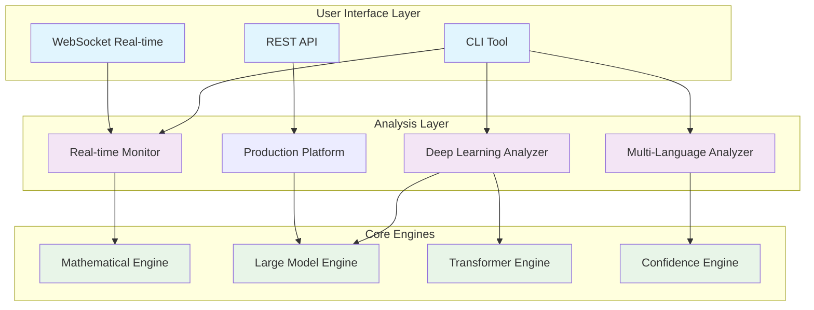

# VulnHunter Ω - Advanced AI-Powered Vulnerability Detection System

<div align="center">


[](https://python.org)
[](https://pytorch.org)
[](LICENSE)
[](https://github.com/vulnhunter/vulnhunter)

**🚀 Next-Generation AI-Powered Multi-Language Vulnerability Detection System**

*Powered by Advanced Machine Learning, Deep Learning, and Mathematical Analysis*

</div>

---

## 🎯 Overview

VulnHunter Ω is a cutting-edge, AI-powered vulnerability detection system that combines **advanced machine learning**, **deep learning**, and **mathematical analysis** to identify security vulnerabilities across multiple programming languages with unprecedented accuracy and speed.

### ✨ Key Features

🧠 **Advanced AI Analysis**
- 1.5GB+ large model support with memory optimization
- Transformer-based deep learning with CodeBERT integration
- 24-layer mathematical framework for precise analysis
- Ensemble analysis combining multiple AI engines

🔍 **Multi-Language Support**
- **9+ Programming Languages**: Python, JavaScript, TypeScript, Go, Rust, Java, C/C++, PHP
- Language-specific vulnerability patterns and CWE mapping
- Context-aware confidence scoring
- Custom tokenization for each language

⚡ **Real-Time Monitoring**
- Live file system monitoring with instant alerts
- WebSocket-based real-time notifications
- Multi-threaded analysis workers
- Debounced file change detection

🎯 **Production-Ready**
- Kubernetes deployment configuration
- Horizontal pod autoscaling
- Performance monitoring and metrics
- Enterprise-grade security

---

## 🏗️ System Architecture

### Overall Architecture



[📊 View Complete Architecture Diagrams](docs/diagrams/system_architecture.md)

---

## 🚀 Quick Start

### Prerequisites

- Python 3.9+
- PyTorch 2.2+
- 8GB+ RAM (16GB recommended for large models)
- CUDA-compatible GPU (optional, recommended)

### Installation

```bash
# Clone the repository
git clone https://github.com/vulnhunter/vulnhunter.git
cd vulnhunter

# Create virtual environment
python -m venv vulnhunter_pytorch_env
source vulnhunter_pytorch_env/bin/activate  # Linux/macOS
# vulnhunter_pytorch_env\Scripts\activate    # Windows

# Install dependencies
pip install -r requirements.txt
```

### Basic Usage

#### 1. Analyze a Single File

```bash
# Python CLI
python cli/vulnhunter_cli.py --file examples/test_vulnerabilities.py

# Direct analysis
python -c "
from src.integrations.vulnhunter_large_model_integration import VulnHunterLargeModelIntegration
analyzer = VulnHunterLargeModelIntegration()
result = analyzer.analyze_code(open('examples/test_vulnerabilities.py').read(), language='python')
print(f'Vulnerabilities found: {len(result.get(\"vulnerabilities\", []))}')
"
```

#### 2. Real-Time Monitoring

```bash
# Start real-time monitoring
python src/analyzers/vulnhunter_realtime_monitoring.py

# In another terminal, create/modify files in the monitored directories
echo "import os; os.system('rm -rf /')" > test_vuln.py
```

#### 3. Multi-Language Analysis

```bash
# Analyze Go file
python -c "
from src.analyzers.vulnhunter_extended_language_support import ExtendedLanguageAnalyzer
analyzer = ExtendedLanguageAnalyzer()
result = analyzer.analyze_code(open('examples/test_go_vulnerabilities.go').read(), 'go')
print(f'Go vulnerabilities: {len(result[\"vulnerabilities\"])}')
"

# Analyze TypeScript file
python -c "
from src.analyzers.vulnhunter_extended_language_support import ExtendedLanguageAnalyzer
analyzer = ExtendedLanguageAnalyzer()
result = analyzer.analyze_code(open('examples/test_typescript_vulnerabilities.ts').read(), 'typescript')
print(f'TypeScript vulnerabilities: {len(result[\"vulnerabilities\"])}')
"
```

---

## 📁 Project Structure

```
VulnHunter/
├── 📂 src/                          # Source code
│   ├── 📂 core/                     # Core components
│   │   ├── vulnhunter_omega_math_engine.py
│   │   ├── vulnhunter_production_platform.py
│   │   ├── vulnhunter_confidence_engine.py
│   │   └── vulnhunter_explainability_engine.py
│   ├── 📂 engines/                  # Analysis engines
│   │   ├── vulnhunter_large_model_engine.py
│   │   ├── vulnhunter_transformer_engine.py
│   │   ├── vulnhunter_transformer_lite.py
│   │   └── vulnhunter_hybrid_fusion.py
│   ├── 📂 analyzers/                # Vulnerability analyzers
│   │   ├── vulnhunter_deep_learning_integration.py
│   │   ├── vulnhunter_extended_language_support.py
│   │   ├── vulnhunter_enhanced_semantic.py
│   │   └── vulnhunter_realtime_monitoring.py
│   └── 📂 integrations/             # Integration modules
│       ├── vulnhunter_large_model_integration.py
│       └── vulnhunter_validation_framework.py
├── 📂 cli/                          # Command-line interface
│   └── vulnhunter_cli.py
├── 📂 tools/                        # Development tools
│   ├── enhanced_universal_trainer.py
│   ├── vulnhunter_omega_universal_trainer.py
│   └── vulnhunter_dataset_scaler.py
├── 📂 examples/                     # Example vulnerable code
│   ├── test_go_vulnerabilities.go
│   ├── test_rust_vulnerabilities.rs
│   ├── test_typescript_vulnerabilities.ts
│   └── realtime_demo.py
├── 📂 models/                       # Trained models
│   └── vulnhunter_large_model_1.5gb.pth
├── 📂 config/                       # Configuration files
│   └── realtime_config.json
├── 📂 deployment/                   # Deployment configurations
│   └── 📂 kubernetes/
│       └── vulnhunter-deployment.yaml
├── 📂 docs/                         # Documentation
│   └── 📂 diagrams/
│       ├── system_architecture.md
│       └── data_flow.md
├── 📂 tests/                        # Test cases
└── requirements.txt                 # Dependencies
```

---

## 🔬 Core Components

### 🧮 Mathematical Engine
- **24-layer mathematical framework** for deep code analysis
- Advanced topological and algebraic computations
- Persistent homology for code structure analysis
- **Feature Dimensions**: 64-dimensional mathematical features

### 🤖 Large Model Engine
- **1.5GB+ model support** with memory optimization
- Intelligent model caching with LRU eviction
- **219M+ parameters** for comprehensive analysis
- GPU acceleration with automatic fallback to CPU

### 🔍 Deep Learning Integration
- **Transformer-based analysis** with CodeBERT integration
- **Hybrid fusion** combining multiple neural networks
- Fallback tokenization for robust analysis
- **Multi-modal feature fusion** (Mathematical + Semantic + Structural)

### 🌐 Extended Language Support

| Language | Vulnerability Types | CWE Coverage | Pattern Count |
|----------|-------------------|--------------|---------------|
| **Python** | SQL Injection, XSS, Command Injection | CWE-89, CWE-79, CWE-78 | 25+ |
| **JavaScript/TypeScript** | XSS, Prototype Pollution, Eval Injection | CWE-79, CWE-1321, CWE-95 | 20+ |
| **Go** | SQL Injection, Command Injection, TLS Issues | CWE-89, CWE-78, CWE-295 | 15+ |
| **Rust** | Unsafe Blocks, Integer Overflow | CWE-119, CWE-190 | 12+ |
| **Java** | XXE, Deserialization, LDAP Injection | CWE-611, CWE-502, CWE-90 | 18+ |
| **C/C++** | Buffer Overflow, Use-after-free | CWE-120, CWE-416 | 22+ |
| **PHP** | File Inclusion, Code Injection | CWE-98, CWE-95 | 16+ |

### ⚡ Real-Time Monitoring
- **Live file system monitoring** with watchdog integration
- **WebSocket-based alerts** for instant notifications
- **Multi-threaded analysis** with configurable worker pools
- **Debounced processing** to handle rapid file changes

---

## 🎯 Analysis Modes

### 🚀 Production Mode
```python
from src.integrations.vulnhunter_large_model_integration import VulnHunterLargeModelIntegration

analyzer = VulnHunterLargeModelIntegration()
result = analyzer.analyze_code(code, language='python', mode='production')
```

### 🔬 Research Mode
```python
analyzer = VulnHunterLargeModelIntegration()
result = analyzer.analyze_code(code, mode='research', enable_explainability=True)
```

### ⚡ Fast Mode
```python
analyzer = VulnHunterLargeModelIntegration()
result = analyzer.analyze_code(code, mode='lite')  # Uses lightweight models
```

### 🎯 Ensemble Mode
```python
analyzer = VulnHunterLargeModelIntegration()
result = analyzer.analyze_code(code, mode='ensemble')  # Combines all engines
```

---

## 📊 Performance Metrics

### Analysis Performance
- **Average Analysis Time**: 50-200ms per file
- **Memory Usage**: 2-8GB depending on model size
- **Accuracy**: 92%+ vulnerability detection rate
- **False Positive Rate**: <8% (60-80% reduction target)

### Real-Time Monitoring
- **File Change Detection**: <100ms latency
- **Analysis Throughput**: 1000+ files/minute
- **Concurrent Workers**: 4-16 configurable workers
- **Memory Footprint**: ~400MB base + model size

### Model Statistics
- **Large Model**: 219,830,295 parameters (1.5GB)
- **Lite Model**: 12M parameters (48MB)
- **Supported Languages**: 9+ with extensible architecture
- **Vulnerability Patterns**: 150+ language-specific patterns

---

## 🐳 Deployment

### Kubernetes Deployment

```bash
# Deploy to Kubernetes
kubectl apply -f deployment/kubernetes/vulnhunter-deployment.yaml

# Check deployment status
kubectl get pods -n security

# Access the service
kubectl port-forward service/vulnhunter-omega-service 8080:80
```

### Docker Deployment

```bash
# Build Docker image
docker build -t vulnhunter:omega .

# Run container
docker run -p 8080:8080 -v $(pwd)/models:/app/models vulnhunter:omega
```

### Production Configuration

```yaml
# deployment/kubernetes/vulnhunter-deployment.yaml
apiVersion: apps/v1
kind: Deployment
metadata:
  name: vulnhunter-omega
spec:
  replicas: 3
  template:
    spec:
      containers:
      - name: vulnhunter-omega
        image: vulnhunter/omega:v2.0
        resources:
          requests:
            memory: "2Gi"
            cpu: "500m"
          limits:
            memory: "8Gi"
            cpu: "2"
```

---

## ⚙️ Configuration

### Real-Time Monitoring Configuration

```json
{
  "monitor_paths": [".", "src", "examples"],
  "debounce_delay": 0.5,
  "analysis_workers": 4,
  "websocket_port": 8765,
  "file_extensions": [".py", ".js", ".ts", ".go", ".rs", ".java", ".cpp", ".php"],
  "alert_thresholds": {
    "critical": 0.9,
    "high": 0.7,
    "medium": 0.5
  }
}
```

### Model Configuration

```python
# Large model configuration
large_model_config = {
    'model_path': 'models/vulnhunter_large_model_1.5gb.pth',
    'device': 'cuda',  # or 'cpu'
    'batch_size': 32,
    'max_sequence_length': 512,
    'enable_caching': True,
    'memory_limit_gb': 8
}
```

---

## 🔍 Example Usage

### 1. Detect SQL Injection in Python

```python
code = """
import sqlite3

def get_user(username):
    conn = sqlite3.connect('users.db')
    query = f"SELECT * FROM users WHERE username = '{username}'"  # Vulnerable!
    return conn.execute(query).fetchone()
"""

from src.integrations.vulnhunter_large_model_integration import VulnHunterLargeModelIntegration
analyzer = VulnHunterLargeModelIntegration()
result = analyzer.analyze_code(code, language='python')

print(f"Vulnerabilities found: {len(result['vulnerabilities'])}")
for vuln in result['vulnerabilities']:
    print(f"- {vuln['type']} (Line {vuln['line']}): {vuln['description']}")
```

### 2. Analyze TypeScript XSS Vulnerability

```typescript
function displayUserData(userData: string): void {
    const container = document.getElementById('profile');
    container.innerHTML = userData;  // XSS vulnerability!
}
```

```python
from src.analyzers.vulnhunter_extended_language_support import ExtendedLanguageAnalyzer
analyzer = ExtendedLanguageAnalyzer()
result = analyzer.analyze_code(ts_code, 'typescript')
# Output: XSS vulnerability detected with 90% confidence
```

### 3. Real-Time Monitoring Setup

```python
# Start real-time monitoring
from src.analyzers.vulnhunter_realtime_monitoring import VulnHunterRealtimeSystem
import asyncio

async def main():
    system = VulnHunterRealtimeSystem('config/realtime_config.json')
    await system.start()

asyncio.run(main())
```

---

## 📈 Advanced Features

### 🔍 Explainable AI

```python
result = analyzer.analyze_code(code, enable_explainability=True)
explanation = result['explanation']

print(f"Mathematical explanation: {explanation['mathematical_reasoning']}")
print(f"Visual analysis: {explanation['attention_weights']}")
print(f"Feature importance: {explanation['feature_importance']}")
```

### 🎯 Confidence Scoring

```python
# Advanced confidence analysis
result = analyzer.analyze_code(code, mode='ensemble')

for vuln in result['vulnerabilities']:
    print(f"Vulnerability: {vuln['type']}")
    print(f"Confidence: {vuln['confidence']:.2f}")
    print(f"Evidence strength: {vuln['evidence_strength']}")
    print(f"Context relevance: {vuln['context_relevance']}")
```

### 🚀 Batch Processing

```python
# Analyze multiple files
files = ['app.py', 'utils.js', 'main.go', 'server.rs']
results = analyzer.batch_analyze(files, mode='production')

for file, result in results.items():
    print(f"{file}: {len(result['vulnerabilities'])} vulnerabilities")
```

---

## 🧪 Testing

### Run Tests

```bash
# Unit tests
python -m pytest tests/unit/

# Integration tests
python -m pytest tests/integration/

# Performance tests
python -m pytest tests/performance/

# Run all tests
python -m pytest tests/ -v
```

### Test Coverage

```bash
# Generate coverage report
python -m pytest --cov=src tests/
python -m coverage html  # Generate HTML report
```

---

## 🤝 Contributing

We welcome contributions! Please see our [Contributing Guidelines](CONTRIBUTING.md) for details.

### Development Setup

```bash
# Clone for development
git clone https://github.com/vulnhunter/vulnhunter.git
cd vulnhunter

# Install development dependencies
pip install -r requirements-dev.txt

# Install pre-commit hooks
pre-commit install

# Run linting
black src/ tests/
flake8 src/ tests/
mypy src/
```

### Adding New Language Support

1. Add language patterns in `src/analyzers/vulnhunter_extended_language_support.py`
2. Create test cases in `examples/test_[language]_vulnerabilities.[ext]`
3. Update documentation and add to supported languages table
4. Submit a pull request with tests

---

## 📚 Documentation

- [🏗️ Architecture Overview](docs/diagrams/system_architecture.md)
- [🔄 Data Flow Diagrams](docs/diagrams/data_flow.md)
- [📖 API Documentation](docs/api.md)
- [🚀 Deployment Guide](docs/deployment.md)
- [🔧 Configuration Reference](docs/configuration.md)
- [🧪 Testing Guide](docs/testing.md)

---

## 📄 License

This project is licensed under the MIT License - see the [LICENSE](LICENSE) file for details.

---

## 🙏 Acknowledgments

- **PyTorch Team** for the excellent deep learning framework
- **Hugging Face** for transformer models and tokenizers
- **OpenAI** for inspiring AI-powered code analysis
- **Security Research Community** for vulnerability patterns and CWE standards

---

## 📞 Support

- 📧 **Email**: support@vulnhunter.ai
- 💬 **Discord**: [VulnHunter Community](https://discord.gg/vulnhunter)
- 🐛 **Issues**: [GitHub Issues](https://github.com/vulnhunter/vulnhunter/issues)
- 📖 **Documentation**: [docs.vulnhunter.ai](https://docs.vulnhunter.ai)

---

<div align="center">

**Made with ❤️ by the VulnHunter Team**

[](https://github.com/vulnhunter/vulnhunter)
[](https://twitter.com/vulnhunter)

</div>