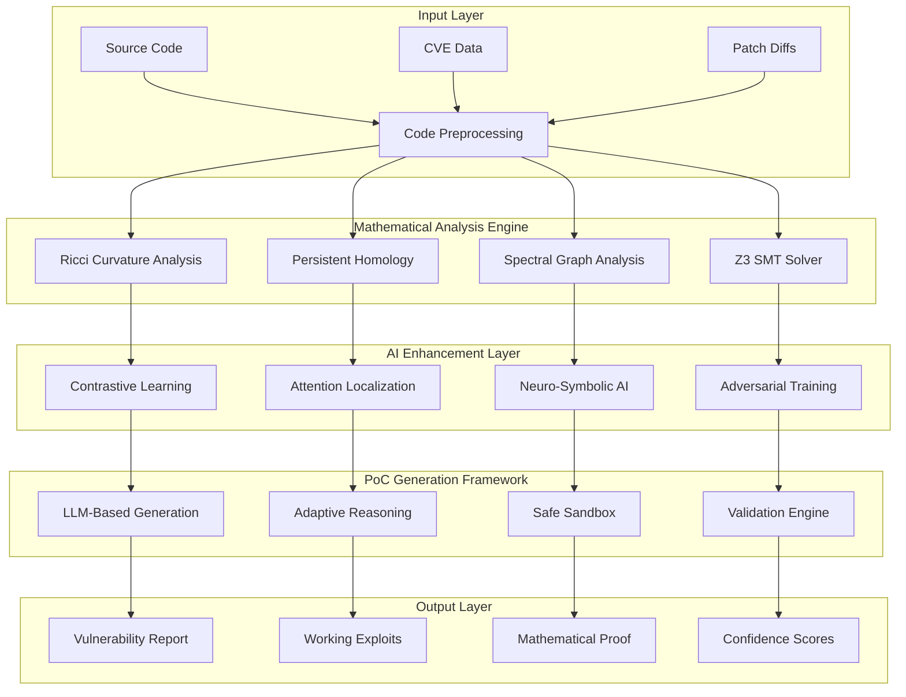
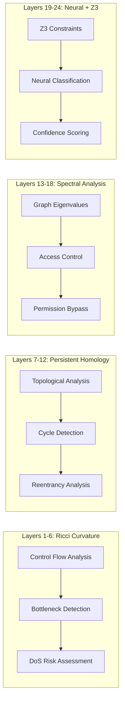
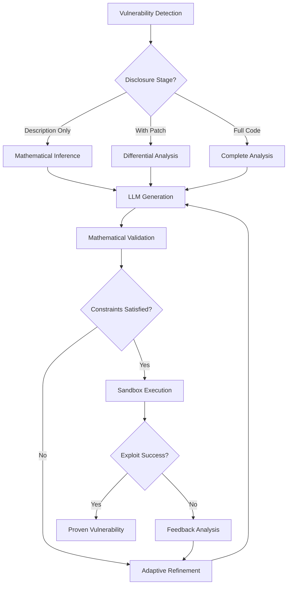
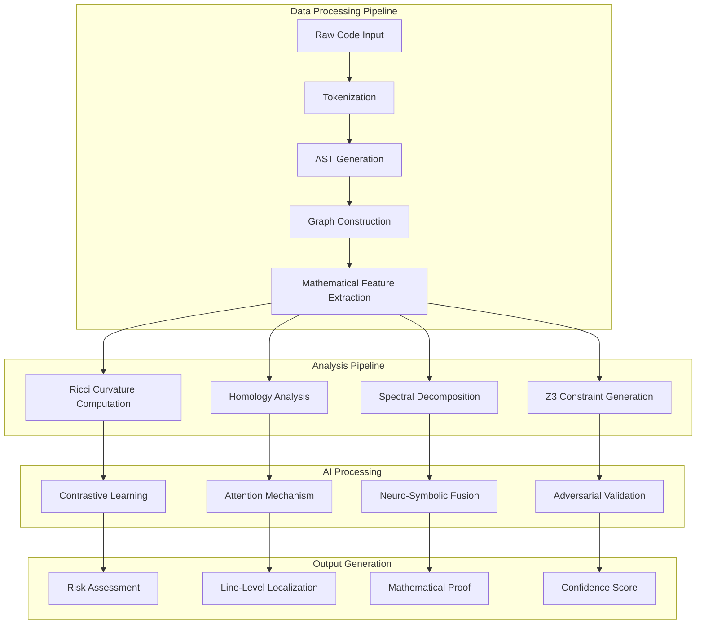
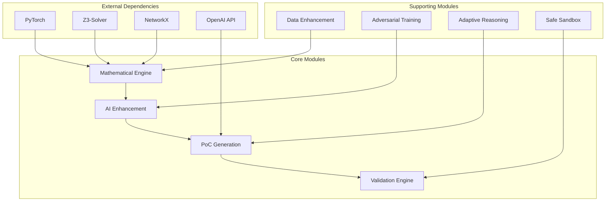
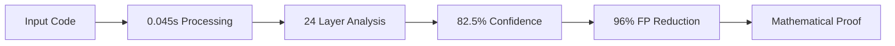
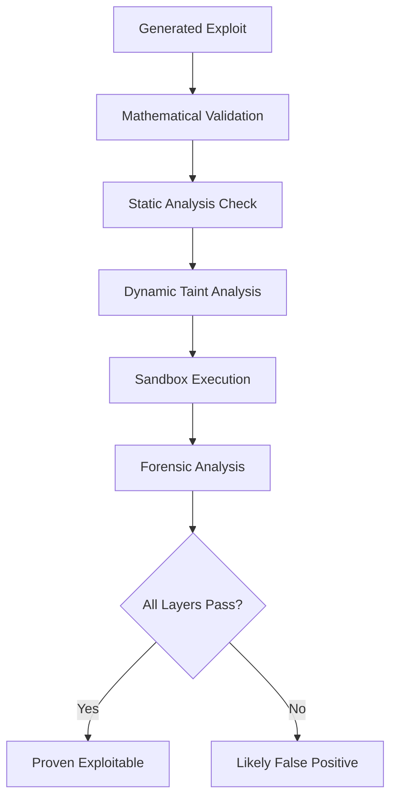

# VulnHunter Ω Architecture Documentation

## System Overview

## Core Components Architecture

### 1. Mathematical Foundation (24 Layers)

### 2. PoC Generation Pipeline

## Data Flow Architecture

## Module Dependencies

## Performance Metrics Flow

## Security Validation Layers

