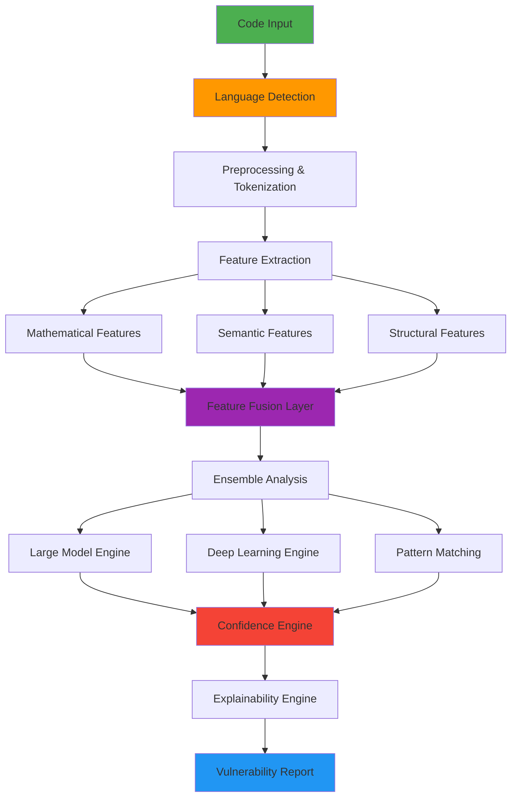
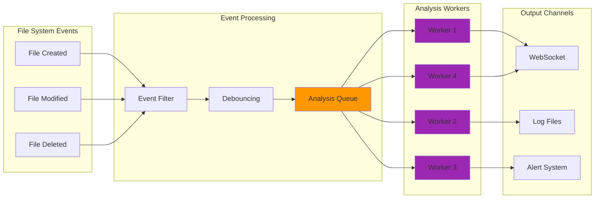
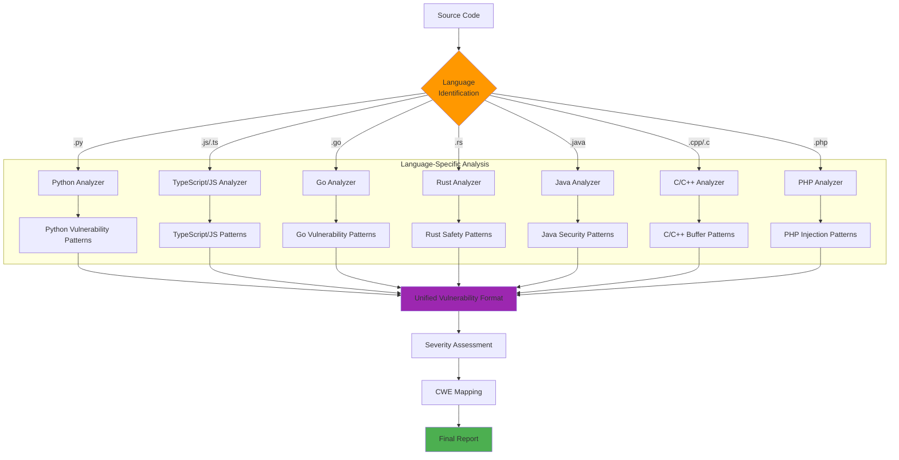
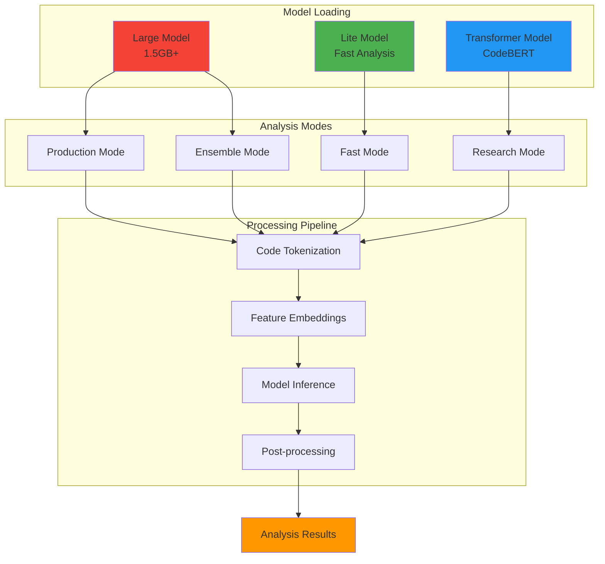
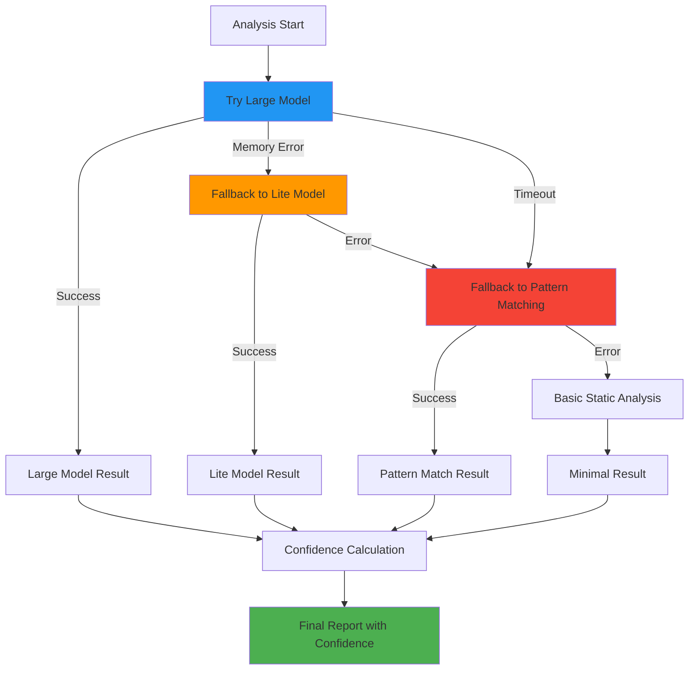
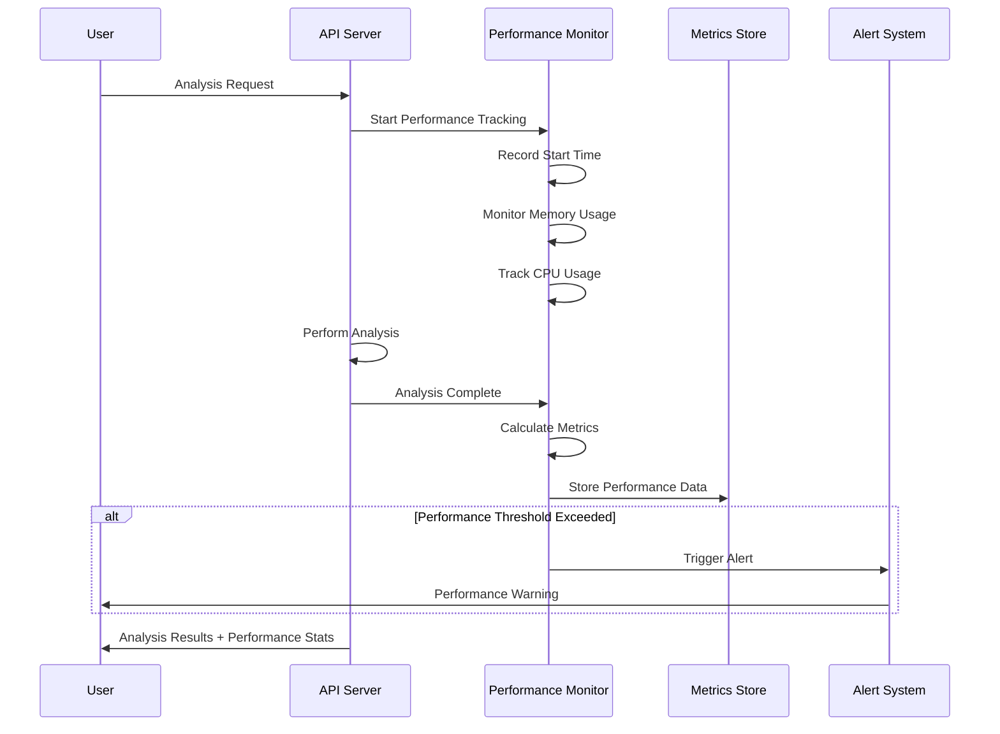

# VulnHunter Data Flow Diagrams

## Analysis Pipeline Flow

## Real-time Processing Flow

## Multi-Language Analysis Flow

## Model Integration Flow

## Error Handling Flow

## Performance Monitoring Flow

