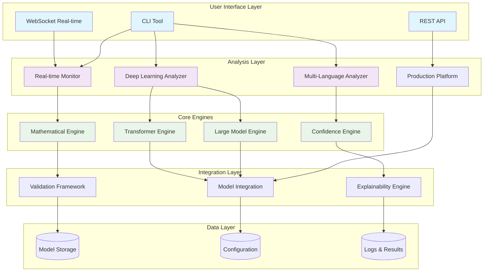
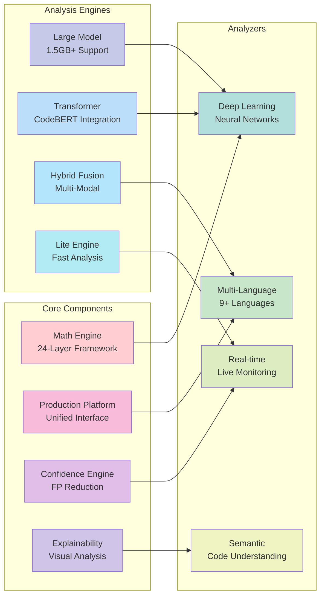
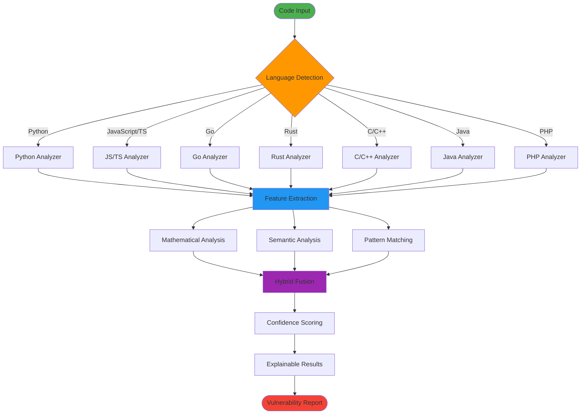
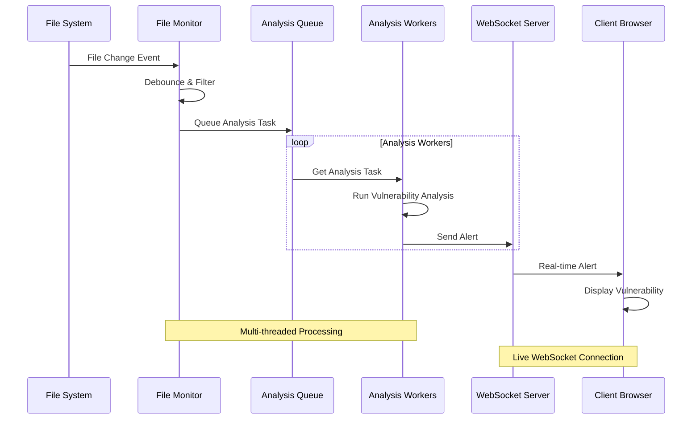
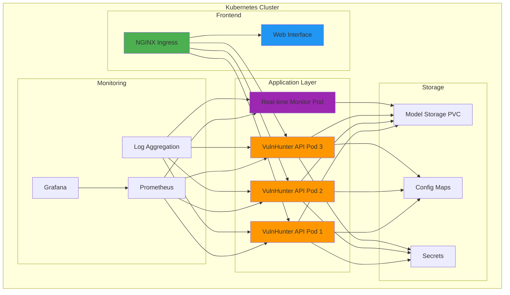
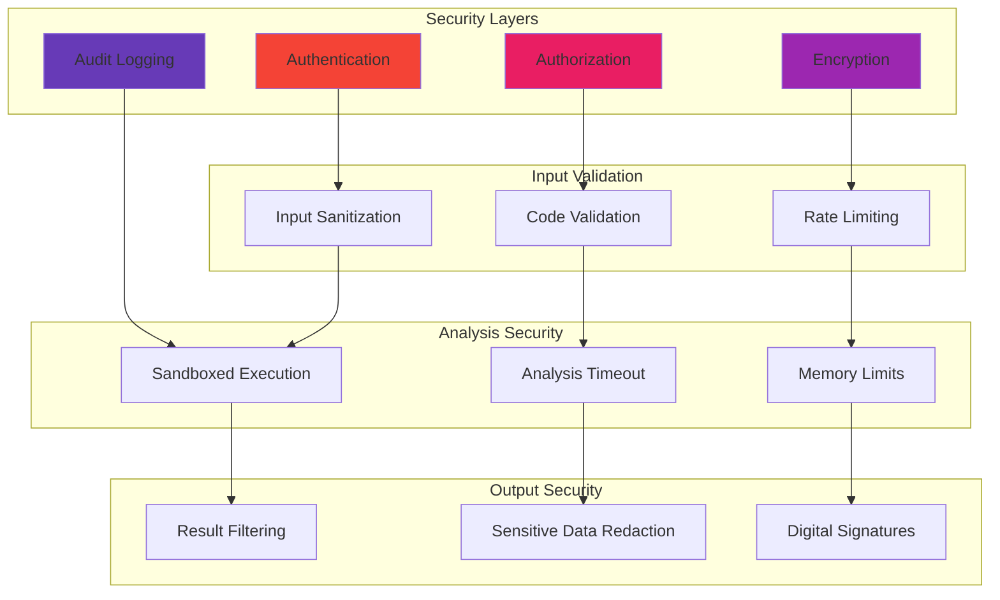

# VulnHunter Ω System Architecture

## Overall System Architecture

## Component Architecture

## Data Flow Architecture

## Real-time Monitoring Architecture

## Deployment Architecture

## Security Architecture

